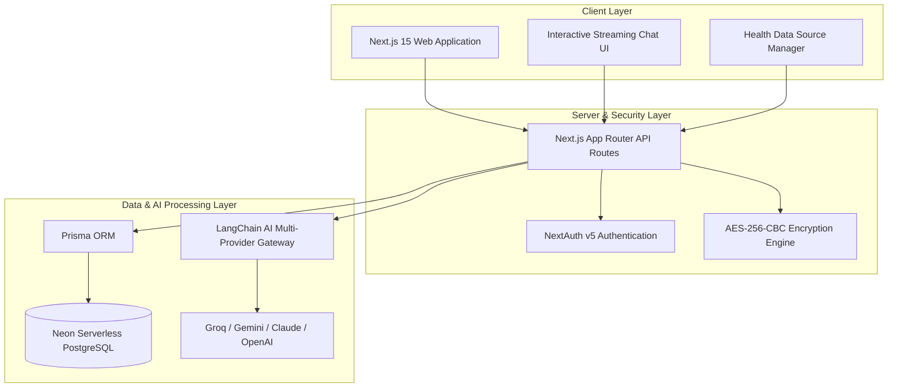

# 🏥 Smart Health AI

<div align="center">

**Intelligent Healthcare Analytics & Contextual Medical Assistant Platform**

[](https://nextjs.org/)
[](https://www.typescriptlang.org/)
[](https://www.prisma.io/)
[](https://neon.tech/)

</div>

---

## 🌟 Overview

**Smart Health AI** is an advanced personal healthcare assistant platform that empowers users to consolidate, manage, and understand their health data with high precision. By combining document parsing with state-of-the-art Large Language Models (LLMs), Smart Health AI turns raw medical records (blood tests, checkups, clinical imaging, and symptoms) into structured intelligence and interactive medical consultations.

---

## ✨ Features

- 📊 **Centralized Clinical Data Ingestion:** Upload blood test scans, lab checkups, clinical PDFs, and personal symptom logs.
- 🛠️ **Smart Multimodal Parsing:** Automatically extracts clinical biomarkers and lab values into structured, queryable data formats.
- 🤝 **Contextual Healthcare Conversations:** Engage in real-time, streaming AI consultations where the LLM utilizes your parsed medical history as grounding context.
- 🔒 **End-to-End Cryptographic Security:** Sensitive LLM API credentials are encrypted at rest using AES-256-CBC with cryptographically secure random Initialization Vectors (IVs).
- 🌐 **Multi-Model Orchestration:** Support for Google Gemini, Groq (OpenAI-compatible), Claude, OpenAI, and local Ollama models.
- 🌍 **Internationalization (i18n):** Multi-language user interface support.

---

## 🏗️ System Architecture



---

## 🚀 Quick Start Guide

### 1. Prerequisites
- **Node.js**: v18 or higher
- **PostgreSQL**: Neon DB or local PostgreSQL instance
- **GraphicsMagick & Ghostscript**: For document and PDF parsing

```bash
brew install graphicsmagick ghostscript
```

### 2. Environment Configuration
Create a `.env` file in the root directory:

```env
DATABASE_URL="postgresql://<user>:<password>@<neon-host>/<db>?sslmode=require"
AUTH_SECRET="<generated-random-secret>"
ENCRYPTION_KEY="<base64-encoded-32-byte-key>"
NEXT_PUBLIC_URL="http://localhost:3000"
DEPLOYMENT_ENV="local"
```

### 3. Install & Initialize Database
```bash
npm install
npx prisma generate
npx prisma db push
```

### 4. Run Development Server
```bash
npm run dev
```

Visit **http://localhost:3000** in your browser, create an account, and configure your preferred AI provider (Groq, Gemini, OpenAI, or Ollama) in the settings.

---

## 📄 License
This project is licensed under the [GNU Affero General Public License v3.0](LICENSE).
